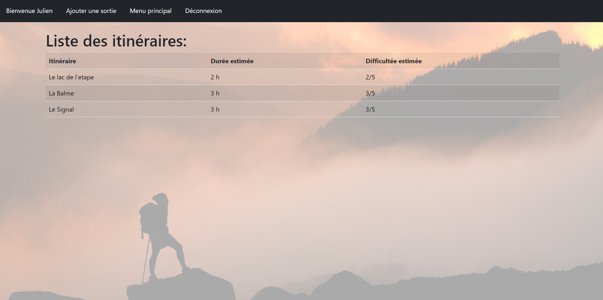

# Topoguide - Application pour les Randonneurs

Topoguide est une application web construite avec Django, destinée aux randonneurs et aux amateurs de plein air. Elle offre aux utilisateurs la possibilité de découvrir, de parcourir et de partager des itinéraires de randonnée passionnants, ainsi que des informations détaillées sur les sorties associées à ces itinéraires.

## Informations Techniques

### Dépendances

- Django
- django-bootstrap-v5

### Identifiants de Connexion

Pour explorer l'application, vous pouvez utiliser les identifiants suivants :

1. **Superutilisateur** :
   - Identifiant: Julien
   - Mot de passe: mdp
   - Statut: Superutilisateur (accès à l'administration)

2. **Utilisateur Standard** :
   - Identifiant: Toto
   - Mot de passe: mdp12345
   - Statut: Utilisateur

## Description Rapide

Topoguide est conçu pour offrir une expérience utilisateur transparente, tant pour les randonneurs en herbe que pour les experts chevronnés. Voici un aperçu des fonctionnalités de l'application :

**Utilisateur Non Connecté :**

- **Connexion** : Les utilisateurs non connectés peuvent s'identifier en utilisant le bouton "Connexion" dans la barre de navigation.
- **Liste d'Itinéraires** : Consultez la liste des itinéraires disponibles en accédant à la page `/itinéraires/`.
- **Liste de Sorties par Itinéraire** : Découvrez la liste des sorties associées à un itinéraire en particulier en visitant la page `/itinéraires/<id de l'itinéraire>/ListeSorties/`.
- **Détail d'une Sortie** : Obtenez des informations détaillées sur une sortie spécifique en visitant `/itinéraires/<id de l'itinéraire>/ListeSorties/`.

**Utilisateur Connecté :**

- **Déconnexion** : Les utilisateurs connectés peuvent se déconnecter à tout moment en utilisant le bouton "Déconnexion" dans la barre de navigation.
- **Changement d'Utilisateur** : L'utilisateur peut facilement se connecter sous un autre compte en cliquant sur son nom d'utilisateur.
- **Liste d'Itinéraires** : Accédez à la liste d'itinéraires disponibles via la page `/itinéraires/`.
- **Liste de Sorties par Itinéraire** : Explorez les sorties associées à un itinéraire particulier en visitant `/itinéraires/<id de l'itinéraire>/ListeSorties/`.
- **Détail d'une Sortie** : Consultez des informations détaillées sur une sortie spécifique en visitant `/itinéraires/<id de l'itinéraire>/ListeSorties/`.
- **Ajout de Sortie** : Les utilisateurs connectés peuvent ajouter de nouvelles sorties via la page `/itinéraires/AjouterModifierSortie`.
- **Modification de Sortie** : Les utilisateurs connectés peuvent également modifier les sorties qu'ils ont ajoutées via la page `/itinéraires/AjouterModifierSortie`.

Topoguide offre ainsi une expérience complète aux randonneurs pour explorer, planifier et partager leurs aventures en plein air. Profitez de l'application et découvrez de nouveaux horizons !
